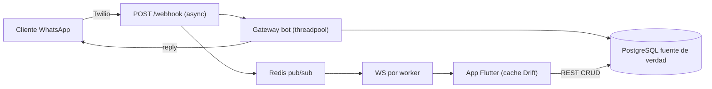

# WhatsBot: una sola fuente de verdad (BD del servidor), multi-tenant y panel tipo WhatsApp Business

## Decision de arquitectura (responde tu duda sobre la BD)

Si: hace falta una base de datos en el **servidor**, y es la **fuente de verdad**. No se puede dejar solo la BD del telefono porque el bot corre en el servidor: cuando un cliente escribe, Twilio llama a `POST /webhook` en el servidor y el bot debe leer menu/intents/estado y responder aunque el dueno tenga la app cerrada. Ademas es multi-negocio y multi-dispositivo.

- **Servidor = fuente de verdad**: PostgreSQL en produccion (lo que pide el alcance "escala/multi-worker/Redis"); SQLite solo para desarrollo local. El codigo ya soporta ambos en [infrastructure/database.py](infrastructure/database.py).
- **Telefono = cache offline-first** (Drift/SQLite en [whatsbot_app/lib/data/local/app_database.dart](whatsbot_app/lib/data/local/app_database.dart)). Esto es lo que ya hace que se sienta "como WhatsApp" (mensajes instantaneos, offline, ticks) via `sync_engine` + `message_repository`. Se conserva y se extiende.

## Estado actual (hallazgos clave de la exploracion)

- Google Sheets **sigue siendo la fuente de verdad** del bot para pedidos/usuarios/reservas/bloqueos. `GOOGLE_SHEETS_ENABLED=false` solo apaga el **espejo** ([services/sheets_sync_service.py](services/sheets_sync_service.py)), NO el cliente Sheets del bot ([chatbot/runtime.py](chatbot/runtime.py) L53-63, [chatbot/app/integrations/google_sheets.py](chatbot/app/integrations/google_sheets.py)).
- Estado de conversacion = un solo JSON por `wa_id` ([chatbot/app/core/state_manager.py](chatbot/app/core/state_manager.py)) -> negocios distintos mezclan carrito (P5).
- Intents mutan globals de modulo por request ([chatbot/business_context.py](chatbot/business_context.py) L64-114) -> cruce entre negocios bajo concurrencia (P1).
- `Customer` existe pero **no se usa** ([models/customer.py](models/customer.py)); no hay rutas ni pantalla de clientes.
- PIN global unico ([api/routes/auth.py](api/routes/auth.py)); rutas `/businesses`, `/menus`, `/orders` **sin auth**; webhook sin firma Twilio.
- WS en memoria; `REDIS_URL` definido pero sin usar ([services/realtime_service.py](services/realtime_service.py)).
- App Flutter ya tiene: chats en tiempo real, editores de menu/intents/prompts, aprobar/rechazar pedido en el chat. Falta: clientes CRUD, lista de pedidos, shell de navegacion.

---

## OLA 1 - Integridad de datos y eliminacion total de Google Sheets

Objetivo: una sola fuente de verdad (BD), sin Sheets.

1. **Migraciones reales (Alembic)** en vez de `create_all`: inicializar `alembic/`, baseline del esquema actual, y migracion para los cambios siguientes. Reemplazar el uso de `Base.metadata.create_all` en [infrastructure/database.py](infrastructure/database.py) y documentar `alembic upgrade head` en scripts.
2. **Integridad referencial**: anadir FK real `Conversation.business_id -> businesses.id` ([models/conversation.py](models/conversation.py)) y activar `PRAGMA foreign_keys=ON` para SQLite via `event.listens_for(engine, "connect")` en [infrastructure/database.py](infrastructure/database.py) (en Postgres ya aplica).
3. **Reescribir los servicios del bot para que lean/escriban solo en BD** (scoped por `business_id`):
   - `order_service` legacy ([chatbot/app/services/order_service.py](chatbot/app/services/order_service.py)) -> usar [services/order_service.py](services/order_service.py) (`create_order/get_order/update_order_status`).
   - `menu_service` legacy ([chatbot/app/services/menu_service.py](chatbot/app/services/menu_service.py)) -> quitar fallback a Sheets, usar siempre `services/menu_service.list_menu_items(db, business_id)`.
   - `user_service` legacy ([chatbot/app/services/user_service.py](chatbot/app/services/user_service.py)) y bloqueados ([chatbot/app/services/blocked_users_cache.py](chatbot/app/services/blocked_users_cache.py)) -> usar tabla `customers` ([models/customer.py](models/customer.py)), anadiendo columnas `blocked`, `last_order_items` (JSON), `notes`.
   - reservas ([chatbot/app/services/reservation_service.py](chatbot/app/services/reservation_service.py)) -> nueva tabla `reservations` + servicio, o eliminar si no se usa (confirmar uso real).
   - pedidos pendientes del recordatorio admin: consulta BD `status=pending` por negocio en vez de `sheets.get_pending_orders()`.
4. **Eliminar Sheets del codigo**: borrar [chatbot/app/integrations/google_sheets.py](chatbot/app/integrations/google_sheets.py), [services/sheets_sync_service.py](services/sheets_sync_service.py), [api/routes/sheets.py](api/routes/sheets.py), [config/sheets_config.py](config/sheets_config.py); quitar el cableado Sheets en [chatbot/runtime.py](chatbot/runtime.py); quitar `google_spreadsheet_id`/`sheets_enabled` de [models/business.py](models/business.py) (migracion drop column); quitar el hook `maybe_sync_menu_after_update` en [api/routes/whatsbot.py](api/routes/whatsbot.py) y `maybe_sync_order_after_update` en [services/notification_service.py](services/notification_service.py); quitar `gspread` de [requirements.txt](requirements.txt); borrar `data/*_cache.json`; limpiar `.env`/`.env.example` y [README.md](README.md).
5. **Confirmacion de pedidos 100% en BD** (P6/P7): que `approve_order_from_app`/`reject_order_from_app` ([services/notification_service.py](services/notification_service.py)) operen solo contra `services/order_service` validando que el `order.business_id` coincide con el del token; eliminar la dependencia de `admin.order_service.confirm_order` (Sheets).

## OLA 2 - Correctitud multi-tenant

Objetivo: que dos negocios concurrentes nunca se crucen.

6. **Estado de conversacion por `(business_id, wa_id)`** (P5): reemplazar el JSON global de [chatbot/app/core/state_manager.py](chatbot/app/core/state_manager.py) por persistencia en BD (nueva tabla `conversation_states(business_id, wa_id, flow, step, data JSON)`) o Redis; pasar `business_id` desde `gateway` hasta `flow_engine.process_message`.
7. **Aislar intents sin globals** (P1): eliminar la mutacion de `config.intents.GLOBAL_COMMAND_INTENTS` y `parser._INTENT_*` en [chatbot/business_context.py](chatbot/business_context.py); pasar el indice de intents por request (parametro/contextvar inmutable) o cachear por `business_id` (LRU). Quitar `_intent_lock` global.
8. **Identidad por negocio**: usar `Business.admin_whatsapp_number` y nombre del negocio por tenant en lugar de `ADMIN_WHATSAPP_NUMBER`/`RESTAURANT_NAME` globales (afecta `_render` de flow_engine y notificaciones admin).
9. **Resolucion de negocio robusta**: revisar el match por sufijo de telefono ([services/business_service.py](services/business_service.py)) para que sea exacto por `twilio_whatsapp_from`.

## OLA 3 - Seguridad y mensajeria robusta

10. **Firma Twilio** (P3): middleware con `RequestValidator` en `/webhook` y `/webhook/status` ([api/routes/whatsapp.py](api/routes/whatsapp.py)); 403 si invalida.
11. **Credencial por negocio** (P2): columna `pin_hash` (bcrypt) en `businesses`; `auth/login` valida el PIN contra ESE negocio ([api/routes/auth.py](api/routes/auth.py)); `passlib[bcrypt]` ya esta en requirements.
12. **Secretos fail-fast**: arrancar con error si `JWT_SECRET_KEY` vacio o de ejemplo ([config/settings.py](config/settings.py), [api/middleware/auth.py](api/middleware/auth.py)).
13. **Proteger rutas abiertas**: exigir JWT y scope por `business_id` en `/businesses`, `/menus`, `/orders` ([api/routes/businesses.py](api/routes/businesses.py), [api/routes/menus.py](api/routes/menus.py), [api/routes/orders.py](api/routes/orders.py)) o moverlas bajo `/whatsbot`.
14. **CORS allowlist** ([api/main.py](api/main.py)) en vez de `*` con credenciales.
15. **Envio del dueno con estado `failed`** (P9): que `send_whatsapp_message` propague el fallo y `send_owner_message` ([api/routes/whatsbot.py](api/routes/whatsbot.py)) marque `failed`; la app muestra reintento (ya hay cola saliente en [whatsbot_app/lib/data/repositories/message_repository.dart](whatsbot_app/lib/data/repositories/message_repository.dart)).
16. **Webhook no bloqueante** (P4): correr el gateway en threadpool (`run_in_threadpool`) para no bloquear el event loop ([api/routes/whatsapp.py](api/routes/whatsapp.py)).

## OLA 4 - Escala horizontal

17. **WS sobre Redis pub/sub** (P8): que `RealtimeHub` publique/suscriba en Redis ([services/realtime_service.py](services/realtime_service.py)) usando `REDIS_URL` (ya en settings); cada worker entrega a sus sockets. Implementar `infrastructure/cache.py` (hoy stub).
18. **API stateless multi-worker**: con estado de conversacion en BD/Redis y WS sobre Redis, correr N workers detras de LB; health check de WS.

## OLA 5 - App Flutter: panel tipo WhatsApp Business

Base: conservar todo lo que ya funciona (chats, menu/intents/prompts, aprobar/rechazar en chat). Agregar el panel de administracion.

19. **Shell de navegacion** (tabs/Drawer): Chats | Pedidos | Clientes | Catalogo | Ajustes. Hoy es stack plano desde [whatsbot_app/lib/screens/chats_list_screen.dart](whatsbot_app/lib/screens/chats_list_screen.dart).
20. **Clientes CRUD**:
   - Backend: rutas `GET/POST/PUT/DELETE /whatsbot/customers` (scoped por token) + `customer_service` sobre [models/customer.py](models/customer.py) (con `notes`).
   - App: `CustomersListScreen` + `CustomerEditorScreen`, `customer_repository`, metodos en [whatsbot_app/lib/services/api_client.dart](whatsbot_app/lib/services/api_client.dart). Enlazar perfil de cliente desde el chat.
21. **Catalogo/Menu**: reutilizar [whatsbot_app/lib/screens/menu_editor_screen.dart](whatsbot_app/lib/screens/menu_editor_screen.dart) (ya CRUD via `PUT /whatsbot/business/menu`); opcional cache offline y categorias.
22. **Mensajes/flujos del bot**: conservar editores de prompts/intents existentes; si se requiere editar el grafo de flujos, anadir API y `FlowsEditorScreen` (los flujos hoy viven en [flows/restaurant_flow.json](flows/restaurant_flow.json); para multi-tenant moverlos a BD por negocio).
23. **Lista de pedidos** (opcional): `OrdersListScreen` consumiendo `GET /whatsbot/orders` (historico) ademas del aprobar/rechazar en chat ya existente.

## OLA 6 - Validacion y criterios de "perfecto"

24. **Tests de aislamiento multi-tenant**: negocio A no ve datos de B; 2 webhooks concurrentes sin cruce de intents/carrito.
25. **Tests de webhook firmado** (403 si firma invalida), login por negocio, y E2E sin Sheets.
26. **Carga**: objetivo de mensajes/min con N workers + Redis sin degradar el loop.
27. Actualizar [README.md](README.md) y scripts de validacion ([scripts/validate_system.py](scripts/validate_system.py), [scripts/validate_chatbot.py](scripts/validate_chatbot.py)) quitando pasos de Sheets.

Criterios de aceptacion: una sola fuente de verdad por entidad (BD), sin codigo Sheets; estado de conversacion e intents aislados por negocio (probado bajo concurrencia); firma Twilio + PIN por negocio + JWT obligatorio; CORS allowlist; envio del dueno con `failed`+reintento; WS sobre Redis en multi-worker; app con panel completo (clientes/catalogo/mensajes) sobre el cache offline existente.